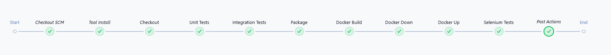
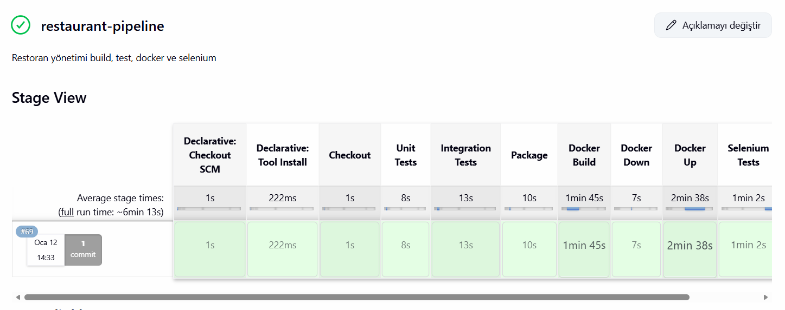

# 🍽️ YDG Restoran Yönetim Sistemi – CI/CD Pipeline Entegrasyonu

Bu proje, Spring Boot tabanlı restoran yönetim sistemi backend uygulamasını modern DevOps pratikleri kullanarak Jenkins CI/CD pipeline, Docker containerization ve otomatik test süreçleri ile entegre eden bir sistemdir.

Proje, Continuous Integration ve Continuous Deployment (CI/CD) süreçlerinin gerçek bir backend uygulaması üzerinde uygulanmasını göstermektedir.

---

## 🚀 Proje Özellikleri

* Spring Boot REST API backend
* CRUD operasyonları
* Docker container desteği
* Docker Compose ile otomatik container yönetimi
* Jenkins CI/CD Pipeline entegrasyonu
* Unit Test ve Integration Test otomasyonu
* Selenium Test entegrasyonu
* Otomatik build ve deployment

---

## 🛠️ Kullanılan Teknolojiler

* Java 17
* Spring Boot
* Maven
* Docker
* Docker Compose
* Jenkins
* Selenium
* JUnit
* GitHub

---

## 🔄 Jenkins CI/CD Pipeline

Bu proje Jenkins pipeline kullanarak aşağıdaki aşamaları otomatik olarak gerçekleştirmektedir:

* Source Code Checkout
* Tool Installation
* Build işlemi
* Unit Tests çalıştırma
* Integration Tests çalıştırma
* Package oluşturma
* Docker Image Build
* Docker Container Stop & Remove
* Docker Container Deploy
* Selenium Testleri çalıştırma

---

## 📊 Jenkins Pipeline Görünümü

### Pipeline Overview



---

### Stage View



---

### Pipeline Success Status


---

## 🐳 Docker Entegrasyonu

Docker kullanılarak uygulama container içinde çalıştırılır:

```bash
docker-compose up --build
```

Docker işlemleri Jenkins pipeline tarafından otomatik yönetilmektedir.

---

## 🧪 Test Süreçleri

Pipeline içinde otomatik olarak:

* Unit Tests
* Integration Tests
* Selenium Tests

çalıştırılmaktadır.

Bu sayede uygulama sürekli test edilmekte ve güvenli deployment sağlanmaktadır.

---

## 📂 Proje Yapısı

```
YDG-Restoran-Sistemi/
│
├── src/
├── Dockerfile
├── docker-compose.yaml
├── Jenkinsfile
├── pom.xml
└── README.md
```

---

## ⚙️ Projeyi Çalıştırma

### Repository klonlama

```bash
git clone https://github.com/yeliznurkilic/YDG-Restoran-Sistemi.git
cd YDG-Restoran-Sistemi
```

### Docker ile çalıştırma

```bash
docker-compose up --build
```

---

## 🎯 CI/CD Pipeline Aşamaları

```
Checkout SCM
Tool Install
Checkout
Unit Tests
Integration Tests
Package
Docker Build
Docker Down
Docker Up
Selenium Tests
Post Actions
```

---

## 👩‍💻 Geliştirici

Yeliznur Kılıç

GitHub:
https://github.com/yeliznurkilic

---

## 📌 Proje Amacı

Bu proje aşağıdaki konuların uygulanması amacıyla geliştirilmiştir:

* Spring Boot backend geliştirme
* Jenkins CI/CD pipeline kurulumu
* Docker containerization
* Test automation
* DevOps süreçleri

---

## ⭐ Öne Çıkan Özellik

Bu proje gerçek bir CI/CD pipeline içeren, Docker ve test entegrasyonuna sahip production benzeri backend sistem örneğidir.
